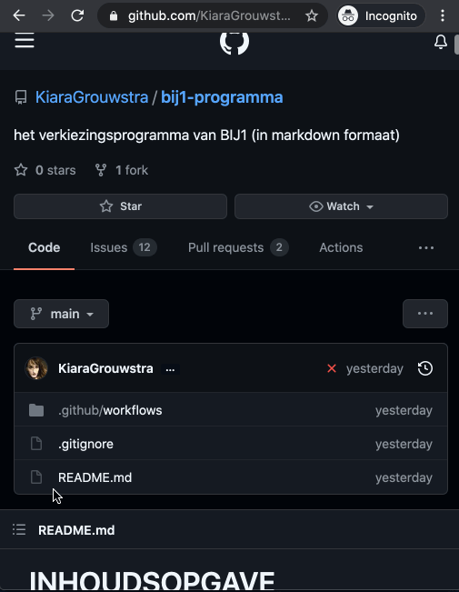

# bij1-programma

## programma lezen

- **op github**: ga naar [`programma.md`](./programma.md)
- **website**: https://bij1.org/programma/

## ideeën

Heb je een idee maar weet je nog niet precies hoe het amendement eruit moet zien? Omschrijf dan wat er beter kan in een nieuwe [issue](issues/new/choose)!

## amendementen maken

### amendementen maken via de browser

- Maak een account en log in
- Ga naar de file [`programma.md`](./programma.md)
- Duw op ✏️ **Edit File** (op mobile verstopt achter **...**)
- Als Github vraagt of je een *fork* wil maken duw **OK**
- Maak je gewenste amendementen
- Omschrijf je amendement onderaan de pagina en duw op **Propose Changes**
- Duw vervolgens tweemaal op **Create Pull Request**

Animatie die dit proces laat zien:

### offline amendementen maken

Het is tevens mogelijk om offline aan amendementen te werken.
Dit kan ofwel via een grafische tool als [Github Desktop](https://desktop.github.com/), ofwel (gevorderden) via [Git](https://git-scm.com/).
